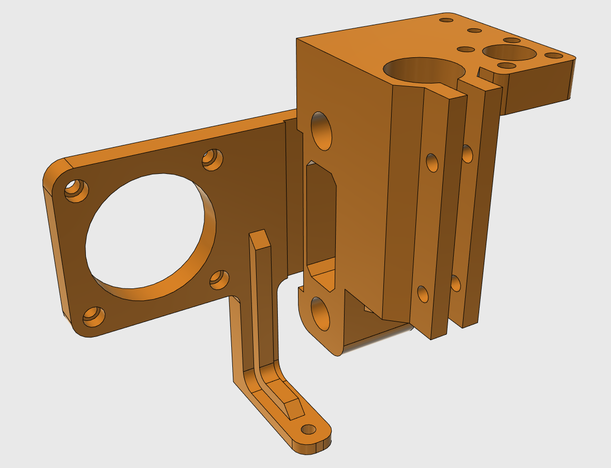
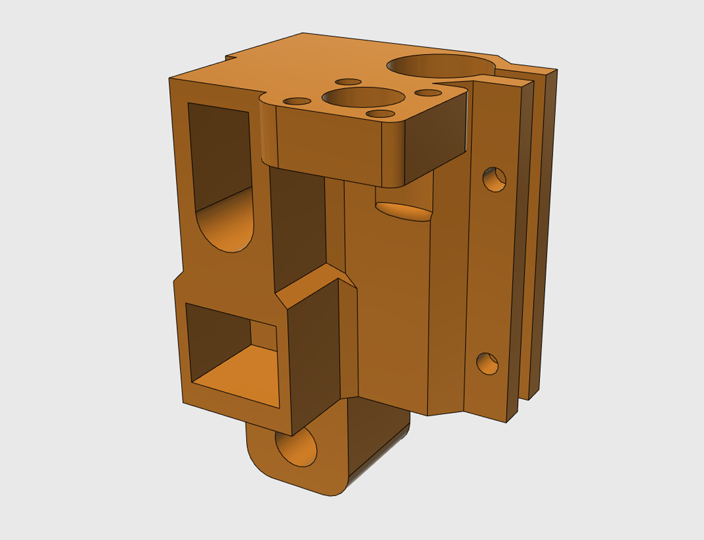
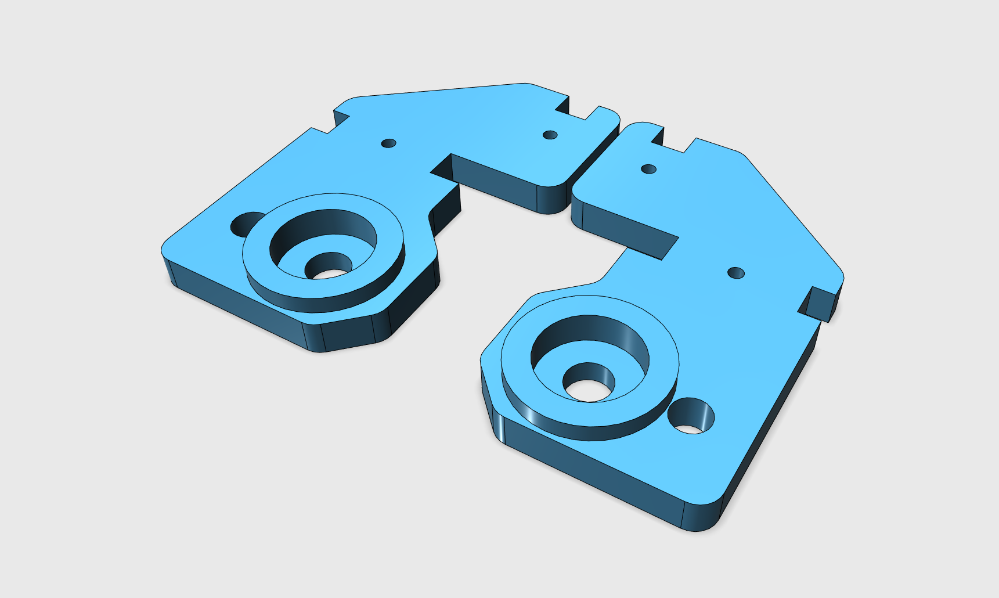
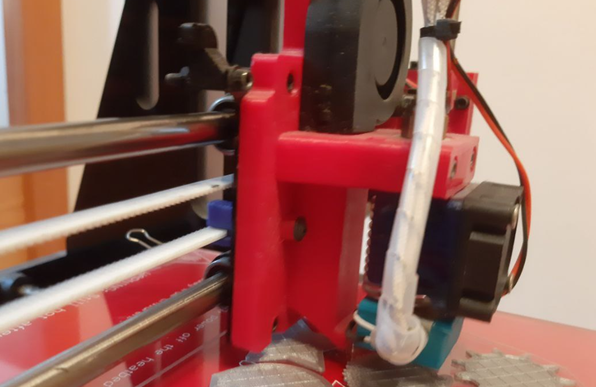

# Geeetech Prusa i3 Hardwareupgrade

This repositiory includes many hardwareupgrades done by me to improve the overall print quality. You can preview all models directly on github in the stl folder.

## Z-Axis Sled

The z-axis sled got complely reworked.

_(The left vertical axis)_

_(The right vertical axis)_

## Z-Axis Rotary Bearing Holder

To further reduce the sound level, two bearings were added. Those also reduce the wear on the rod.

_(Bearing holder)_

## Bowden Extruder

My design is based on [this one by Tech2C](https://www.thingiverse.com/thing:1632847) but was heavily modified.

_(The bowden extruder)_
